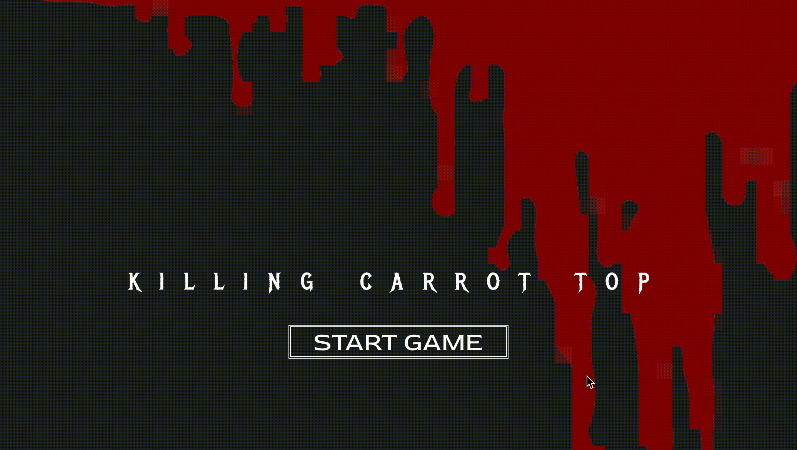
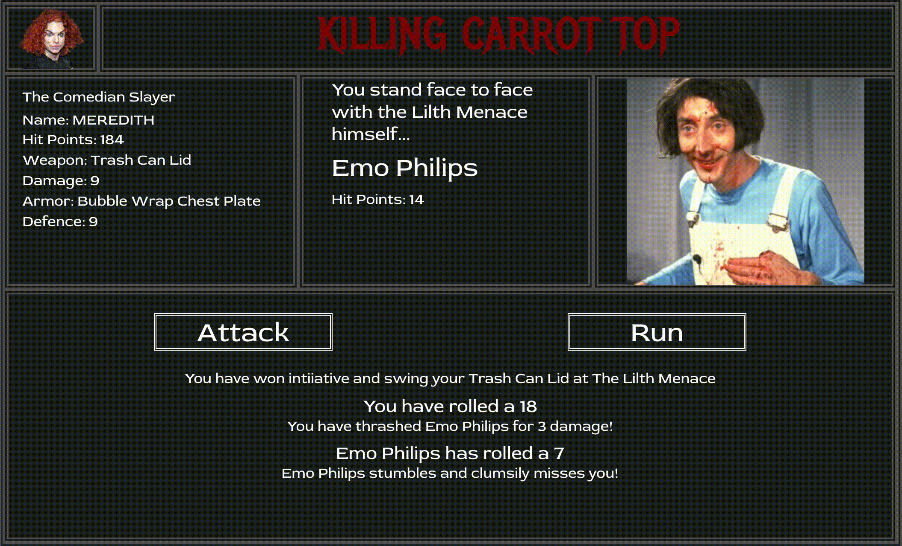
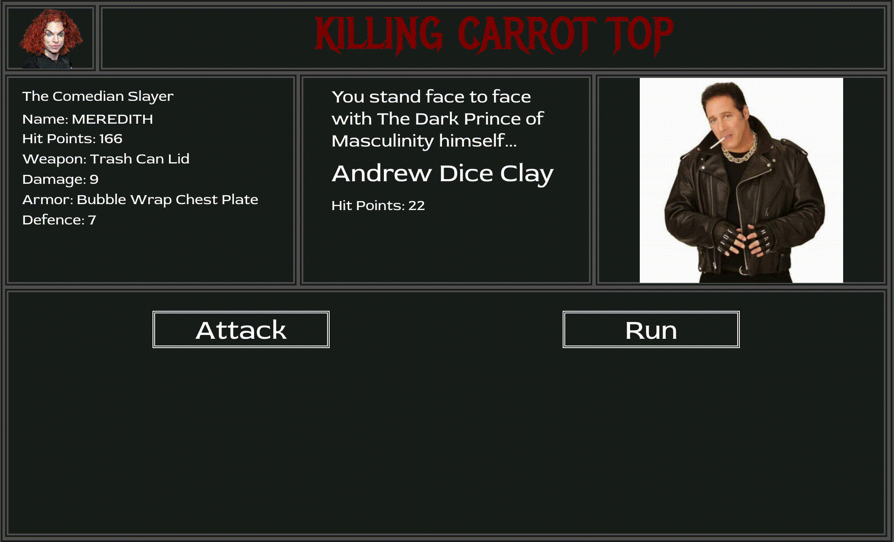

# KILLING CARROT TOP

## By **Jay Winebrenner**

##  About

Killing Carrot Top is an old school RPG-inspired game set in a collapsed dystopian world ruled by 80s Character Comedians hellbent on exterminating what little remains of the human race. You are the Comedian Slayer, the worlds last bastion of hope of stopping this vile scourge. It is your singular journey to traverse the nightmarish post-apocalyptic landscape and confront the Lord of Laughter himself, Carrot Top.

### Kill Enemies, Collect Loot, Kill Carrot Top

## Setup/Installation Requirements

## Outline
`Chapter One: Emo Phillips
Chapter Two: Tim Allen
Chapter Three: Pauly Shore
Chapter Four:  Doors
	Chapter Five: Judy Tenuta
	Chapter Six: Andrew Dice Clay
	Chapter Seven: Sam Kinison
Chapter Eight : Bobcat Goldthwait
Chapter Nine: Doors #2
  Chapter Ten: Victoria Jackson
  Chapter Eleven: Rodney Dangerfield
  Chapter Tweleve: Yakov Smirnoff
Chapter Thirteen: Stairwell (climbing over debris and human waste) / Gallagher
Chapter Fourteen: The Lord of Laughter, Carrot Top`

### Zip:

 1. Go to the repository location where you will find the clone/download button.
 2. Navigate to the directory (folder) that contains your browser's downloads via your terminal or Command Line interface.
 3. Double-click on **killing-carrot-top** directory (folder).
 4. Open the directory contents by extracting/unzipping the documents from the folder.
 5. Type // npm i // followed by // npm start //.  This will open the game on the address of http://localhost:3000/ on your browser.

- - -

## Technologies Used

 - ReactJS

- - -

### Support and Contact

If you run into any issues or have any questions as about anything, please contact **Jay Winebrenner**. jaywinebrenner@gmail.com

### License

Permission is hereby granted, free of charge, to any person obtaining a copy of this software and associated documentation files (the "Software"), to deal in the Software without restriction, including without limitation the rights to use, copy, modify, merge, publish, distribute, sublicense, and/or sell copies of the Software, and to permit persons to whom the Software is furnished to do so, subject to the following conditions:

The above copyright notice and this permission notice shall be included in all copies or substantial portions of the Software.

THE SOFTWARE IS PROVIDED "AS IS", WITHOUT WARRANTY OF ANY KIND, EXPRESS OR IMPLIED, INCLUDING BUT NOT LIMITED TO THE WARRANTIES OF MERCHANTABILITY, FITNESS FOR A PARTICULAR PURPOSE AND NON-INFRINGEMENT. IN NO EVENT SHALL THE AUTHORS OR COPYRIGHT HOLDERS BE LIABLE FOR ANY CLAIM, DAMAGES OR OTHER LIABILITY, WHETHER IN AN ACTION OF CONTRACT, TORT OR OTHERWISE, ARISING FROM, OUT OF OR IN CONNECTION WITH THE SOFTWARE OR THE USE OR OTHER DEALINGS IN THE SOFTWARE.

Copyright (c) 2020 **Jay Winebrenner**

		